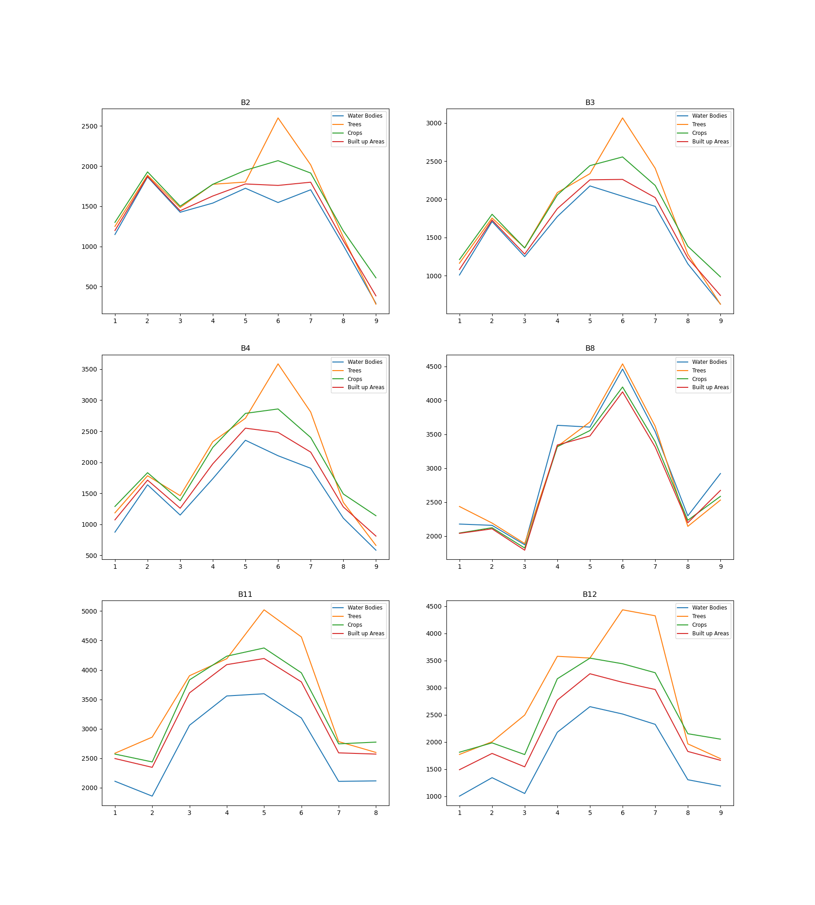
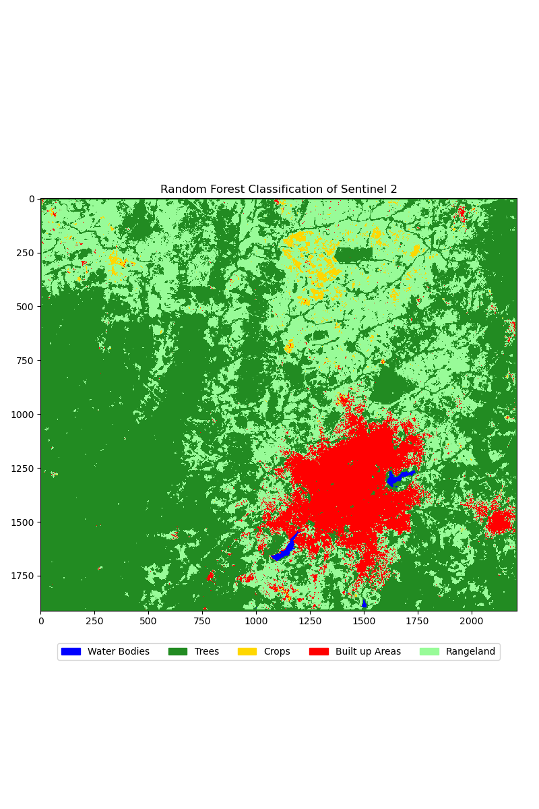
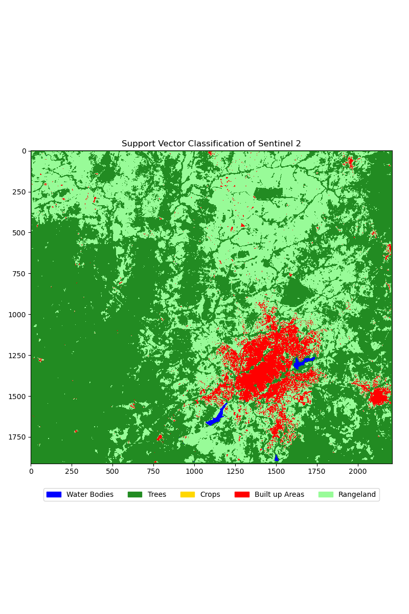

# Sentinel-2-Image-Classification-Using-Random-Forest-and-SVM

## **Project Overview**  
This project analyses Sentinel-2 satellite imagery for Iwo Local Government, Osun State, Nigeria. The study focuses on understanding spatial patterns, extracting key insights using machine learning models, and visualizing vegetation and land cover features.  

The workflow includes:  
1. Data exploration and preprocessing.  
2. Visualization of spectral bands and derived indices (e.g., NDVI).  
3. Implementation of machine learning models for land classification.  

---

## **Objectives**  
- Conduct an exploratory analysis to understand the spectral and spatial characteristics of Sentinel-2 data.    
- Apply machine learning models to classify land cover types and evaluate their performance.  

---

## **Data Sources**  
- **Sentinel-2 Imagery:** Multispectral satellite data providing high-resolution information across 13 spectral bands.  
- **Geospatial Shapefiles:** Boundary data of Iwo Local Government and class files and the feature classes used for the project area ['Water Bodies', 'Trees', 'Crops', 'Built up Areas', 'Bareland', 'Rangeland']
---

## **Methodology**  

### **1. Exploratory Data Analysis (EDA)**  
- **Data Loading and Preparation:**  
  Loaded and preprocessed Sentinel-2 bands using `rasterio`, aligning and clipping the data to the study area.
  - Calculation of NDVI and NDMI

- **Data Visualization:**  
  - True-color and false-color composites were created to visually understand the landscape.
    
    * The top left image shows the `Natural Color` view, which presents the landscape as it would appear to the human eye from above. In this image, we can see what appears to be an urban centre (appearing as a bright white area in the centre) surrounded by darker regions that likely represent less developed or natural areas.
    * The "False Color Composite" (top right) uses specific wavelength bands to emphasize vegetation and urban features. In this visualization, the red areas typically indicate healthy vegetation, while cyan or light blue areas often represent urban development. This color contrast helps easily distinguish between built-up areas and natural vegetation.
    * The "False Color (Urban)" visualization (middle left) is specifically designed to highlight urban areas, showing them in purple tones. This treatment makes it easier to analyze urban sprawl and development patterns. The bright purple area in the center clearly delineates the extent of the urban development.
    * The "Agriculture" image (middle right) uses color coding to emphasize agricultural areas and vegetation health. The bright green areas indicate active agriculture or healthy vegetation, while the purple center represents urban development.
    * The "Vegetation Analysis" (bottom left) appears to use spectral bands that highlight variations in vegetation density and health. The blue areas might indicate less vegetated or bare areas, while the yellow and orange tones could represent different types or states of vegetation cover.
    * The "Land/Water" classification (bottom right) seems designed to distinguish between different land cover types, with blue areas potentially indicating water bodies or moisture content, and the varying shades of green and brown representing different types of land use.

- **Statistical Analysis:**  
  Histograms and scatter plots highlighted the relationships between spectral bands, revealing patterns relevant to land cover classification.  
    
  * In B2 (Blue) (top left), we see relative variations, with pixel values ranging between 1000-2500 units. Trees show the highest peak here, which may imply that the band is particularly sensitive to vegetation.
  * B3 (Green) (top right) shows similar patterns but with slightly higher values, reaching up to 3000 units. This increased sensitivity helps differentiate between different types of vegetation - notice how the tree line (orange) separates more distinctly from crops (green).
  * B4 (Red) (middle left) shows a greater sensitivity, with measurements reaching 3500 units. The separation between different class features becomes apparent, making this band particularly useful for distinguishing between different landscape elements.
  * B8 (NR) (middle right) shows the most dramatic readings of all, with peaks reaching 4500 units. This band appears to be especially sensitive to all features, showing very clear distinctions between them. Notice how all four lines reach their highest points here, suggesting this band might be particularly useful for comprehensive landscape analysis.
  * B11 and B12 (bottom row) show slightly different patterns, with generally higher baseline readings but less dramatic peaks. These bands might be particularly useful for detecting subtle variations in landscape features that other bands might miss.
The relationship between different feature changes across bands is apparent here. For example, water bodies (blue line) generally show lower readings than vegetation, but this difference becomes more or less pronounced in some bands. This varying sensitivity across different bands makes multi-spectral satellite imaging so powerful. It allows for detecting and analysing features that might not be visible to the naked eye.


### **2. Machine Learning Models**  
After preprocessing the data, machine learning models were applied to classify land cover types:  
- **Algorithms Used:**  
  - Random Forest (RF)  
  - Support Vector Machine (SVM)
- **Model Evaluation:**  
  Models were evaluated using accuracy, precision, recall, and F1-score metrics. Confusion matrices were plotted to analyze performance across classes.  

---

## **Results**  
1. **EDA Findings:**  
   -  Distribution of bands and NDVI
     [Band Distribution](results/band_distribution.png)
   - Correlation Analysis. ('results/correlation.csv')

2. **Machine Learning Outputs:**  
   - Random Forest achieved the highest accuracy, effectively classifying forests, urban areas, and agricultural land.
   - Support vector machine (SVM) 
   - Confusion matrices highlighted misclassification trends, such as overlaps between urban and barren lands.
   - Classified images with the models.
     
     
     
---
## **Accuracy Assessment of the Models**  
- **Random Forest:**
  
---

## **Tools and Libraries**  
- **Programming Language:** `Python`  
- **Data Manipulation:** `pandas`, `numpy`  
- **Visualization:** `matplotlib`, `seaborn`, `folium`  
- **Geospatial Analysis:** `rasterio`, `geopandas`, `earthpy`  
- **Machine Learning:** `scikit-learn`
---

## **How to Use**  
1. Clone the repository:  
   ```bash  
   git clone https://github.com/BreadcrumbsSentinel-2-Image-Classification-Using-Random-Forest-and-SVM.git  
   cd entinel-2-Image-Classification   
   ```  

2. Install dependencies:  
   ```bash  
   pip install -r requirements.txt  
   ```  

3. Run the notebooks:  
   Open Jupyter Notebook and follow the steps in the `EDA_and_Machine_Learning.ipynb` and `Model Training` file.  

---

## **Contributors**  
- **Abdulquawiyy A. Owolabi** - Geospatial Scientist  

For questions or contributions, feel free to reach out or open an issue in this repository. 
